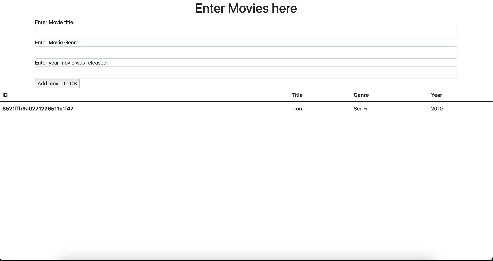

# Movie Database App

## Overview

This application is a simple movie database where you can enter movie details and view them in a table. The frontend is implemented using HTML and Bootstrap, while the backend is implemented using Node.js, Express.js, and MongoDB.

## Installation

### Prerequisites

- Node.js
- MongoDB

### Steps

1. Clone the repository to your local machine.
2. Run `npm install` in the root directory of the project to install all the dependencies.
3. Create a `.env` file and add your MongoDB URI as `MONGODB_URI`.
4. Run `node index.js` to start the server. 

## Code Structure

### HTML

The HTML file contains a form for adding a new movie and a table for displaying the list of movies. Bootstrap is used for styling.

```html
<!-- Form for adding movies -->
<form class="container" action="/" method="post">
  <!-- Fields for title, genre, year -->
</form>

<!-- Table for displaying movies -->
<table class="table">
  <!-- Header and Body -->
</table>
```

### JavaScript

The backend is implemented using Express.js and MongoDB through Mongoose.

#### Dependencies

- Express: Web framework
- Mongoose: MongoDB object modeling
- ejs: Embedded JavaScript templates
- bodyParser: Body parsing middleware

#### Connecting to MongoDB

```js
mongoose.connect(process.env.MONGODB_URI, { /* options */ });
```

#### Data Schema

A schema for movies is defined, including `title`, `genre`, and `year`.

```js
const moviesSchema = {
  title: String,
  genre: String,
  year: String
};
```

#### Routes

- `GET /`: Fetches all movies and renders the index page.
- `POST /`: Adds a new movie to the database.

```js
app.get('/', (req, res) => { /* rendering logic */ });

app.post('/', (req, res) => { /* saving logic */ });
```

## Usage

1. Open the web page.
2. Use the form to enter a movie's details.
3. Click "Add movie to DB" to save the movie.
4. The saved movies will be displayed in a table below.

## External Libraries

- Bootstrap (CDN): For styling
- Mongoose: For MongoDB interactions
